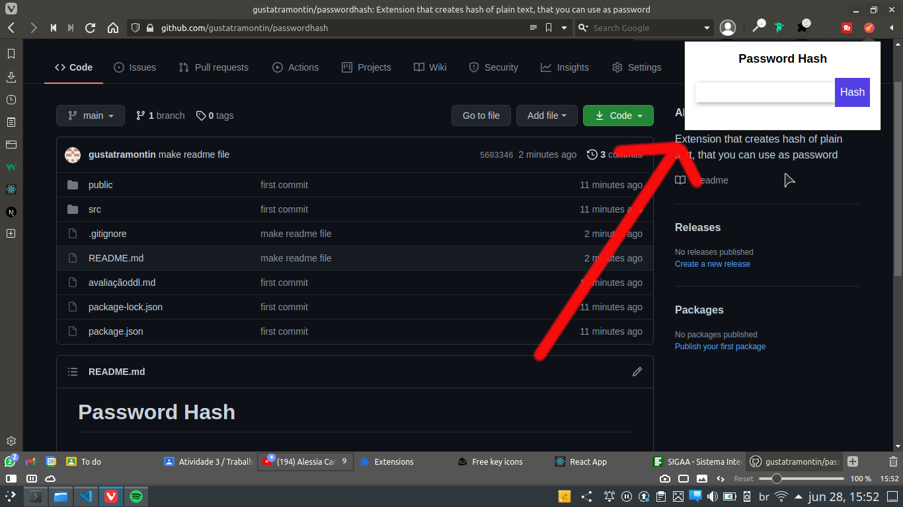

# Password Hash

## What is this

This is a chrome extension that works like a password manager, but it doesn't stores the passwords.

It creates hash from text on a input field, to use it you can make a pattern for each password and use the hash as the password, an example can be "facebook&yourmasterpassword" it generate "u9qKqXw.A35/H/w41.vzvj0MrEiczEqq"

## How to use
First you need to use the command `npm install` to install the dependencies

2nd you need to use the command `npm run build` to create the build

Finally you can load it as a website or pack it as a chrome extension, to do this you need first open extension menu and click on the button "Load Unpacked" and select the build folder